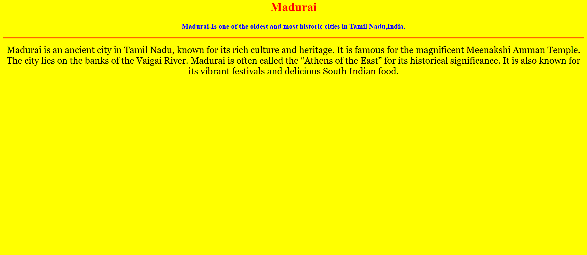
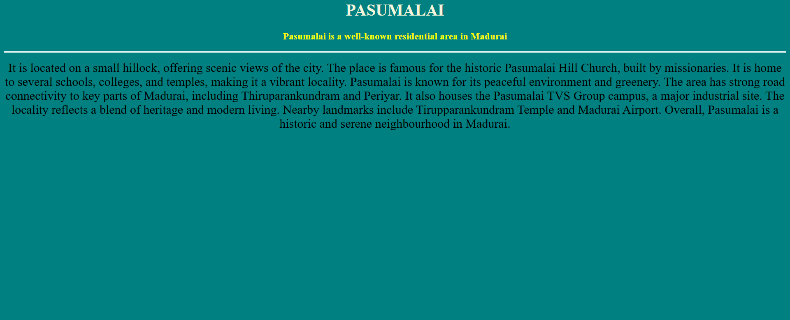
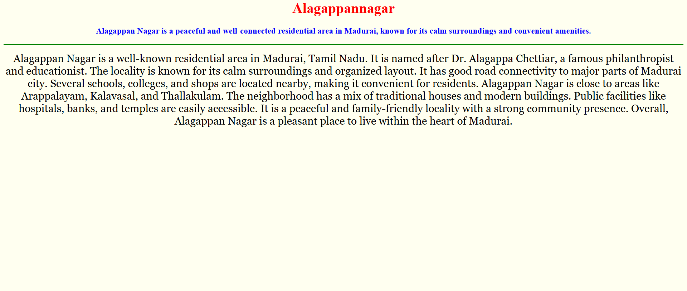
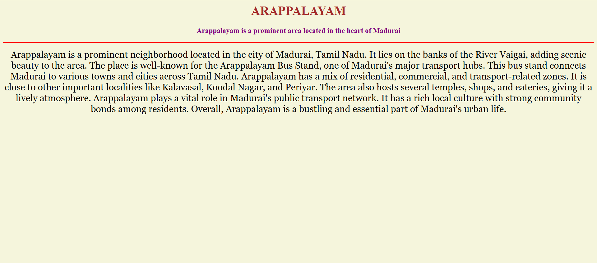

# Ex04 Places Around Me
# Date:02/10/2025
# AIM
To develop a website to display details about the places around my house.

# DESIGN STEPS
## STEP 1
Create a Django admin interface.

## STEP 2
Download your city map from Google.

## STEP 3
Using <map> tag name the map.

## STEP 4
Create clickable regions in the image using <area> tag.

## STEP 5
Write HTML programs for all the regions identified.

## STEP 6
Execute the programs and publish them.

# CODE
```
map.html
<html>
<head>
<title>Image map</title>
</head>
<body>
<h1 align="center"><font color="red"><b>Madurai</b></font></h1>
<h3 align="center"><font color="blue"><b>Sudesan T (25018208)</b></font></h3>


<map name="image-map">
    <area target="" alt="madurai" title="madurai" href="madurai.html" coords="827,341,996,417" shape="rect">
    <area target="" alt="PASUMALAI" title="PASUMALAI" href="PASUMALAI.html" coords="597,590,56" shape="circle">
    <area target="" alt="othakadai" title="othakadai" href="othakadai.html" coords="1326,130,1458,177" shape="rect">
    <area target="" alt="ARAPPALAYAM" title="ARAPPALAYAM" href="ARAPPALAYAM.html" coords="894,329,734,280" shape="rect">
    <area target="" alt="alagappannagar" title="alagappannagar" href="alagappannagar.html" coords="791,531,831,612,728,670,686,566" shape="poly">
</map>
</body>
</html>

madurai.html

<html>
<head>
<title>Madurai</title>
</head>
</html>
<body bgcolor="yellow">
<h1 align="center"><font color="red"><b>Madurai</b></font>
</h1>
<h3 align="center"><font color="blue"><b>Madurai-Is one of the oldest and most historic cities in Tamil Nadu,India.</b>
</font>
</h3>
<hr size="3" color="red">
<p align="center">
<font face="Georgia" size="5">Madurai is one of the oldest and most historic cities in Tamil Nadu, India.
It is often called the “Temple City” because of its many ancient temples.
The Meenakshi Amman Temple is the city's most famous landmark and a major tourist attraction.
Madurai is situated on the banks of the River Vaigai.
The city has a rich cultural heritage and is known for Tamil literature, art, and music.
It was once the capital of the Pandya Kingdom and has great historical importance.
Madurai is also an educational and commercial hub in southern Tamil Nadu.
The city is known for its traditional festivals, especially the Chithirai Festival.
Madurai combines ancient traditions with modern urban development.
It is often called the “Athens of the East” for its cultural and architectural significance.</font>
</p>
</body>

othakadai.html

<html>
<head>
<title>othakadai</title>
</head>
</html>
<body bgcolor="orange">
<h1 align="center"><font color="green"><b>othakadai</b></font>
</h1>
<h3 align="center"><font color="blue"><b>It is connecting point to nearby places like Melut and Alagarkoil</b>
</font>
</h3>
<hr size="3" color="white">
<p align="center">
<font face="Georgia" size="5">Othakadai is a vibrant suburb located in the Madurai district of Tamil Nadu.
It is situated along the Madurai Melur highway (NH 85), making it a key connecting point.
The area is well known for its bustling markets and local businesses.
It has seen rapid residential and commercial development in recent years.
Several schools, colleges, and temples make it a lively community hub.
Public transport and road connectivity to Madurai city are excellent.
The Othakadai bus stop serves as a major transit point for daily commuters.
The locality maintains a balance between modern lifestyle and traditional values.
It is close to popular places like Mattuthavani and Koodal Nagar.
Overall, Othakadai is an important and fast-growing area in Madurai.</font>
</p>
</body>

PASUMALAI.html

<html>
<head>
<title>PASUMALAI</title>
</head>
</html>
<body bgcolor="Teal">
<h1 align="center"><font color="beige"><b>PASUMALAI</b></font>
</h1>
<h3 align="center"><font color="yellow"><b>Pasumalai is a well-known residential area in Madurai</b>
</font>
</h3>
<hr size="3" color="white">
<p align="center">
<font face="elegant serif" size="5">It is located on a small hillock, offering scenic views of the city.
The place is famous for the historic Pasumalai Hill Church, built by missionaries.
It is home to several schools, colleges, and temples, making it a vibrant locality.
Pasumalai is known for its peaceful environment and greenery.
The area has strong road connectivity to key parts of Madurai, including Thiruparankundram and Periyar.
It also houses the Pasumalai TVS Group campus, a major industrial site.
The locality reflects a blend of heritage and modern living.
Nearby landmarks include Tirupparankundram Temple and Madurai Airport.
Overall, Pasumalai is a historic and serene neighbourhood in Madurai.</font>
</p>
</body>

alagappannagar.html

<html>
<head>
<title>alagappannagar</title>
</head>
</html>
<body bgcolor="Ivory">
<h1 align="center"><font color="red"><b>Alagappannagar</b></font>
</h1>
<h3 align="center"><font color="blue"><b>Alagappan Nagar is a peaceful and well-connected residential area in Madurai, known for its calm surroundings and convenient amenities.</b>
</font>
</h3>
<hr size="3" color="green">
<p align="center">
<font face="Georgia" size="5">Alagappan Nagar is a well-known residential area in Madurai, Tamil Nadu.
It is named after Dr. Alagappa Chettiar, a famous philanthropist and educationist.
The locality is known for its calm surroundings and organized layout.
It has good road connectivity to major parts of Madurai city.
Several schools, colleges, and shops are located nearby, making it convenient for residents.
Alagappan Nagar is close to areas like Arappalayam, Kalavasal, and Thallakulam.
The neighborhood has a mix of traditional houses and modern buildings.
Public facilities like hospitals, banks, and temples are easily accessible.
It is a peaceful and family-friendly locality with a strong community presence.
Overall, Alagappan Nagar is a pleasant place to live within the heart of Madurai.</font>
</p>
</body>

ARAPPALAYAM.html

<html>
<head>
<title>ARAPPALAYAM</title>
</head>
</html>
<body bgcolor="beige">
<h1 align="center"><font color="brown"><b>ARAPPALAYAM</b></font>
</h1>
<h3 align="center"><font color="purple"><b>Arappalayam is a prominent area located in the heart of Madurai</b>
</font>
</h3>
<hr size="3" color="red">
<p align="center">
<font face="Georgia" size="5">Arappalayam is a prominent neighborhood located in the city of Madurai, Tamil Nadu.
It lies on the banks of the River Vaigai, adding scenic beauty to the area.
The place is well-known for the Arappalayam Bus Stand, one of Madurai's major transport hubs.
This bus stand connects Madurai to various towns and cities across Tamil Nadu.
Arappalayam has a mix of residential, commercial, and transport-related zones.
It is close to other important localities like Kalavasal, Koodal Nagar, and Periyar.
The area also hosts several temples, shops, and eateries, giving it a lively atmosphere.
Arappalayam plays a vital role in Madurai's public transport network.
It has a rich local culture with strong community bonds among residents.
Overall, Arappalayam is a bustling and essential part of Madurai's urban life.</font>
</p>
</body>
```
OUTPUT
# 






# RESULT
The program for implementing image maps using HTML is executed successfully.
